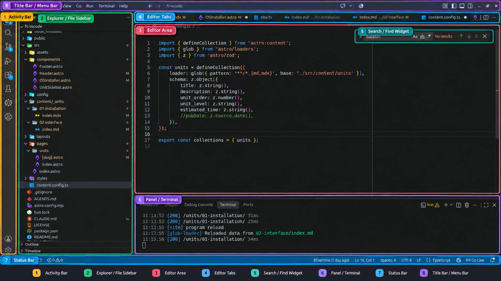

# Exploring the VS Code Interface

VS Code provides several areas that help you work efficiently with your projects.

Following we going to explain what are the main sections of the vscode interface

## Principal menu

This is the principal menu w